# 📋 Hospital Management System - Request Forms Guide

## 📑 Table of Contents
1. [Direct Employment Request (Onboarding)](#1-direct-employment-request-onboarding)
2. [Clearance Request (Exit/Termination)](#2-clearance-request-exittermination)
3. [Assignment Request (Delegation)](#3-assignment-request-delegation)
4. [Assignment Termination Request](#4-assignment-termination-request)
5. [Internal Transfer Request](#5-internal-transfer-request)
6. [Delegation Request](#6-delegation-request)
7. [Leave Request](#7-leave-request)
8. [Exit Request](#8-exit-request)
9. [Salary Certificate Request](#9-salary-certificate-request)
10. [Experience Certificate Request](#10-experience-certificate-request)

---

## 1. Direct Employment Request (Onboarding)

### 📝 Purpose
Submit a new employee onboarding request to officially start work at the hospital.

### 📄 Form Location
`Frontend/HTML/direct-request.html`

### 🔑 Required Fields
- **Basic Information**: First name, Second name, Third name, Job title
- **Work Details**: Work ID, Reason for job (Transfer, Assignment, Appointment, Secondment, Scholarship)
- **Documents**: Document number, Application date, Start date
- **Full Name**: Fourth name, Father name, Grandpa name, Family name
- **Transaction**: Transaction number and date
- **Employee Status**: Full assignment / Partial assignment
- **Identity**: National ID or Iqama number
- **Department Details**: Department, Group, Rank
- **Personal**: Date of birth, Appointment date
- **Employment**: Employment type (Civil service, Self-employment, Surplus workforce, Locum, Partial assignment)
- **Demographics**: Nationality, Gender
- **Reason**: Reason for onboarding

### 📊 Approval Flow

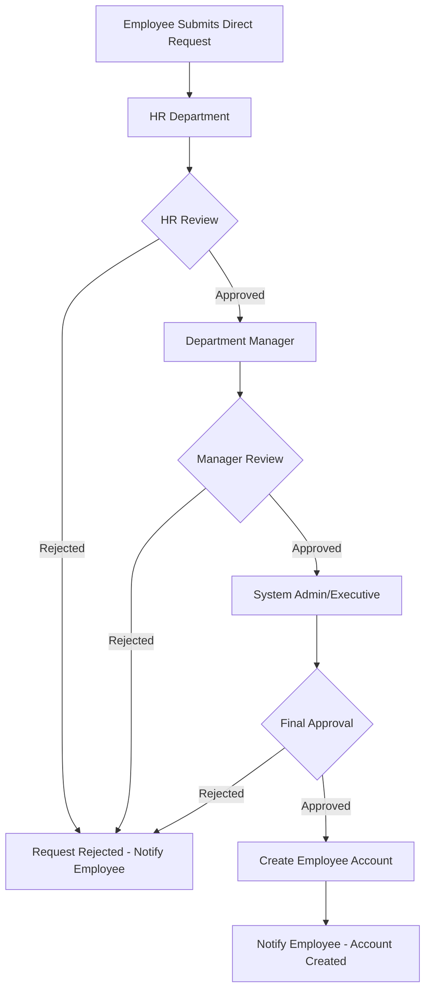

### 👥 Approval Hierarchy
1. **HR Department** - Initial review and validation
2. **Department Manager** - Departmental approval
3. **System Admin/Executive** - Final approval and account creation

### 🔄 API Endpoint
- **POST** `/employee/requests/onboarding`
- **GET** `/employee/requests/onboarding/:id`

### 📧 Notifications
- Employee receives confirmation upon submission
- HR receives new request notification
- Manager receives approval request
- Employee receives final decision notification

---

## 2. Clearance Request (Exit/Termination)

### 📝 Purpose
Submit clearance request when leaving the organization or ending service.

### 📄 Form Location
`Frontend/HTML/clearance-request.html`

### 🔑 Required Fields
- **Employee Data**: First name, Second name, Third name, Employee number
- **Contact**: Email, Mobile, Department, Job title
- **Clearance Type**: End of service / End mid-service
- **Clearance Reason**: 
  - **End of Service**: Retirement, Early retirement, Resignation, Replacement, Contract not renewed, External assignment, Other
  - **Mid-Service**: Due to assignment, Scholarship, Holiday, Transportation, Other
- **Last Work Day**: Date (must be in future)
- **Document Number**: Reference document number
- **Attachments**: Optional supporting documents

### 📊 Approval Flow

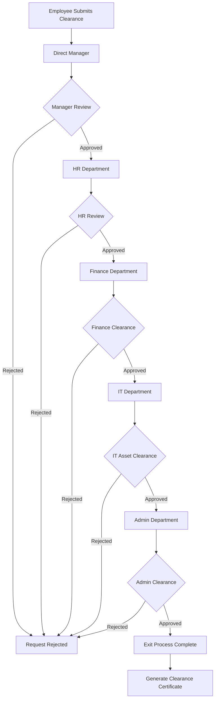

### 👥 Approval Hierarchy
1. **Direct Manager** - Initial approval
2. **HR Department** - HR clearance and documentation
3. **Finance Department** - Financial clearance (salary, benefits, loans)
4. **IT Department** - Asset return (laptop, access cards, systems access)
5. **Admin Department** - Final administrative clearance
6. **System** - Generate clearance certificate

### 🔄 API Endpoint
- **POST** `/employee/requests/clearance`
- **GET** `/employee/requests/clearance/:id`

### 📧 Notifications
- Manager receives clearance request
- Each department receives clearance task
- Employee receives progress updates
- Final clearance certificate sent to employee

---

## 3. Assignment Request (Delegation)

### 📝 Purpose
Request assignment to a new role or additional responsibilities while maintaining current position.

### 📄 Form Location
`Frontend/HTML/assignment-request.html`

### 🔑 Required Fields
- **Employee Data**: First name, Second name, Third name, Employee number, Email, Phone
- **Current Details**: Department, Job title
- **Assignment Type**: Temporary, Permanent, Project-based, Acting (by proxy)
- **New Role**: Role/Task description, New department (optional)
- **Timeline**: Start date, End date (if temporary), Expected duration
- **Financial**: Financial impact (allowances, bonuses)
- **Reason**: Assignment reason and objectives
- **Benefits**: Additional benefits or allowances
- **Notes**: Additional notes

### 📊 Approval Flow

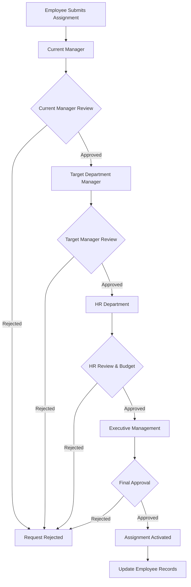

### 👥 Approval Hierarchy
1. **Current Manager** - Release approval
2. **Target Department Manager** - Acceptance approval
3. **HR Department** - HR approval and budget verification
4. **Executive Management** - Final approval (especially for permanent assignments)

### 🔄 API Endpoint
- **POST** `/assignment`
- **GET** `/assignment/:id`

### 📧 Notifications
- Both managers receive approval requests
- HR receives assignment request
- Employee receives status updates
- Final assignment letter issued

---

## 4. Assignment Termination Request

### 📝 Purpose
End an active assignment and return to original position.

### 📄 Form Location
`Frontend/HTML/assignment-termination-request.html`

### 🔑 Required Fields
- **Employee Data**: First name, Second name, Third name, Employee number, Email, Phone
- **Current Assignment**: Assignment role, Assignment department, Start date
- **Termination Details**: Termination date, Return date
- **Return Position**: Return department, Return position
- **Reason**: Termination reason
- **Performance**: Performance evaluation during assignment
- **Lessons Learned**: Lessons from the assignment
- **Notes**: Additional notes

### 📊 Approval Flow

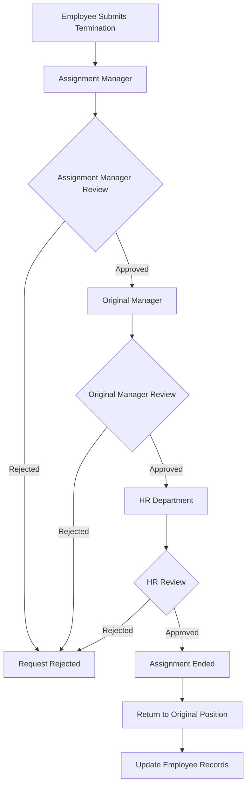

### 👥 Approval Hierarchy
1. **Assignment Manager** - Current manager approval
2. **Original Manager** - Original department acceptance
3. **HR Department** - Final approval and records update

### 🔄 API Endpoint
- **POST** `/assignment-termination`
- **GET** `/assignment-termination/:id`

### 📧 Notifications
- Both managers receive termination notification
- HR receives termination request
- Employee receives confirmation
- Return to work letter issued

---

## 5. Internal Transfer Request

### 📝 Purpose
Request permanent or temporary transfer between departments within the organization.

### 📄 Form Location
`Frontend/HTML/internal-transfer-request.html`

### 🔑 Required Fields
- **Employee Data**: First name, Second name, Third name, Employee number, Email, Phone
- **Current Position**: Current department, Current position, Current location
- **Target Position**: Target department, Target position, Target location
- **Transfer Type**: Permanent, Temporary, Secondment
- **Timeline**: Effective date, Return date (if temporary)
- **Budget Impact**: Impact on budget
- **Reason**: Transfer reason
- **Skills Assessment**: Skills match for new position
- **Training**: Training needed for new position
- **Notes**: Additional notes

### 📊 Approval Flow

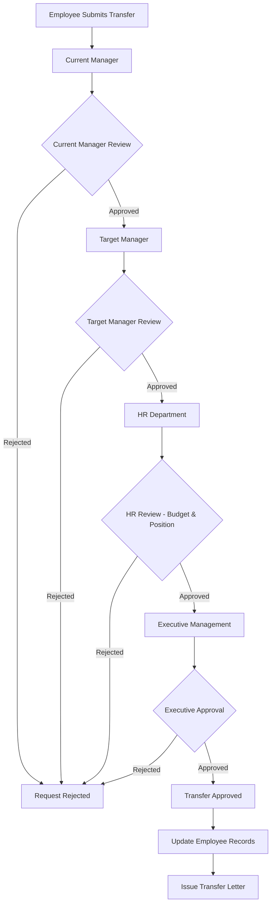

### 👥 Approval Hierarchy
1. **Current Manager** - Release approval
2. **Target Manager** - Acceptance and position availability
3. **HR Department** - HR approval, budget verification, position verification
4. **Executive Management** - Final approval (for permanent transfers)

### 🔄 API Endpoint
- **POST** `/internal-transfer`
- **GET** `/internal-transfer/:id`

### 📧 Notifications
- Both managers receive transfer request
- HR receives transfer notification
- Employee receives status updates
- Transfer order issued upon approval

---

## 6. Delegation Request

### 📝 Purpose
Request temporary delegation of authority or responsibilities to another employee.

### 📄 Form Location
`Frontend/HTML/delegation-request.html`

### 🔑 Required Fields
- **Delegator**: Employee delegating authority
- **Delegate**: Employee receiving delegation
- **Delegation Type**: Full authority, Partial authority, Specific tasks
- **Scope**: Scope of delegation
- **Period**: Start date, End date
- **Reason**: Reason for delegation
- **Tasks**: Specific tasks/responsibilities being delegated

### 📊 Approval Flow

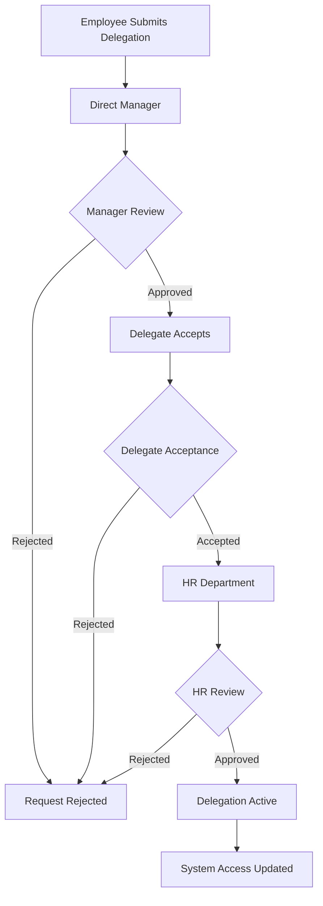

### 👥 Approval Hierarchy
1. **Direct Manager** - Manager approval
2. **Delegate** - Delegate must accept delegation
3. **HR Department** - HR approval and documentation

### 🔄 API Endpoint
- **POST** `/employee/requests/delegation`
- **GET** `/employee/requests/delegation/:id`

### 📧 Notifications
- Manager receives delegation request
- Delegate receives acceptance request
- HR receives delegation notification
- Both parties notified when active
- Reminder before delegation ends

---

## 7. Leave Request

### 📝 Purpose
Request exceptional leave without salary or accompanying scholarship student leave.

### 📄 Form Location
`Frontend/HTML/employee-leave-request.html`

### 🔑 Required Fields
- **Leave Type**: Exceptional leave / Student accompaniment leave
- **Request Type**: New request / Extension / Cancellation
- **Duration**: Start date, End date, Total days
- **Reason**: Detailed reason for leave
- **Contact**: Contact information during leave
- **Supporting Documents**: Attachments (required for student accompaniment)

### 📊 Approval Flow

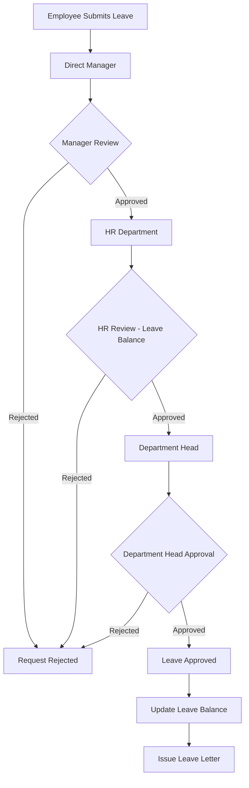

### 👥 Approval Hierarchy
1. **Direct Manager** - Initial approval
2. **HR Department** - Leave balance verification and policy compliance
3. **Department Head** - Final departmental approval

### 🔄 API Endpoint
- **POST** `/employee/requests/leave`
- **GET** `/employee/requests/leave/:id`

### 📧 Notifications
- Manager receives leave request
- HR receives leave notification
- Employee receives approval/rejection
- Reminders before leave starts and ends

---

## 8. Exit Request

### 📝 Purpose
Submit formal resignation or exit request from the organization.

### 📄 Form Location
`Frontend/HTML/employee-exit-request.html`

### 🔑 Required Fields
- **Exit Type**: Resignation, Retirement, Contract end
- **Notice Period**: Last work day (must respect notice period)
- **Reason**: Exit reason
- **Future Plans**: Optional
- **Feedback**: Feedback about work experience

### 📊 Approval Flow

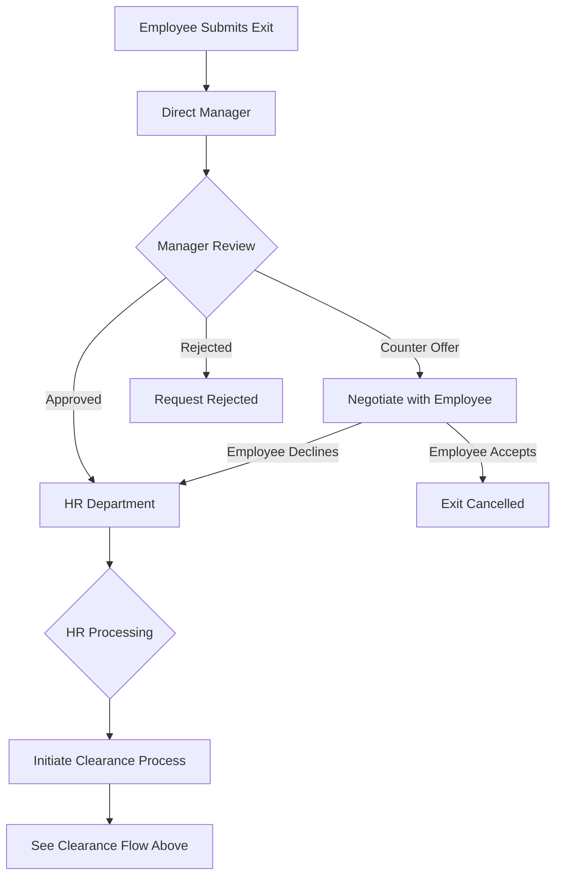

### 👥 Approval Hierarchy
1. **Direct Manager** - Initial review and potential retention
2. **HR Department** - Exit processing and clearance initiation
3. **Multi-Department Clearance** - (See Clearance Request flow)

### 🔄 API Endpoint
- **POST** `/employee/requests/exit`
- **GET** `/employee/requests/exit/:id`

### 📧 Notifications
- Manager receives exit request immediately
- HR receives exit notification
- Exit interview scheduled
- Clearance process initiated

---

## 9. Salary Certificate Request

### 📝 Purpose
Request official certificate stating employment and salary details.

### 📄 Form Location
`Frontend/HTML/certificate-request.html`

### 🔑 Required Fields
- **Purpose**: Reason for certificate (Bank, Visa, Housing, Other)
- **Recipient**: Who will receive the certificate
- **Language**: Arabic, English, or Both
- **Details to Include**: Salary breakdown, allowances, deductions
- **Urgency**: Normal / Urgent

### 📊 Approval Flow

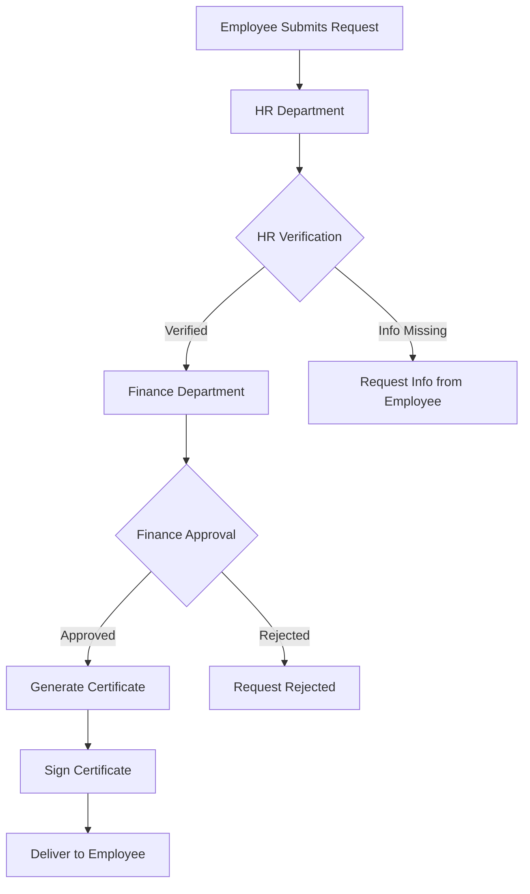

### 👥 Approval Hierarchy
1. **HR Department** - Verify employment details
2. **Finance Department** - Verify salary information
3. **HR Manager** - Sign certificate

### 🔄 API Endpoint
- **POST** `/employee/requests/certificate`
- **GET** `/employee/requests/certificate/:id`

### 📧 Notifications
- HR receives certificate request
- Employee receives status updates
- Employee notified when ready for pickup/delivery

### ⏱️ Processing Time
- Normal: 2-3 business days
- Urgent: Same day (additional approval required)

---

## 10. Experience Certificate Request

### 📝 Purpose
Request certificate documenting work experience and positions held.

### 📄 Form Location
`Frontend/HTML/employee-certificate-request.html`

### 🔑 Required Fields
- **Employee Details**: Name, National ID, Job title
- **Employment Period**: Start date, End date
- **Service Type**: Civil service, Self-employment
- **Positions Held**: List of positions during employment
- **Purpose**: Reason for requesting certificate
- **Language**: Arabic, English, or Both

### 📊 Approval Flow

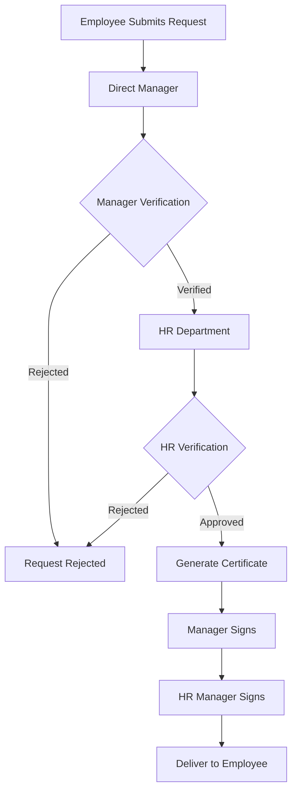

### 👥 Approval Hierarchy
1. **Direct Manager** - Verify positions and performance
2. **HR Department** - Verify employment records and dates
3. **HR Manager** - Final signature

### 🔄 API Endpoint
- **POST** `/employee/requests/experience-certificate`
- **GET** `/employee/requests/experience-certificate/:id`

### 📧 Notifications
- Manager receives verification request
- HR receives certificate request
- Employee receives status updates
- Employee notified when ready

### ⏱️ Processing Time
- Standard: 3-5 business days
- Urgent: 1-2 business days (with manager approval)

---

## 📊 Overall Request Status Workflow

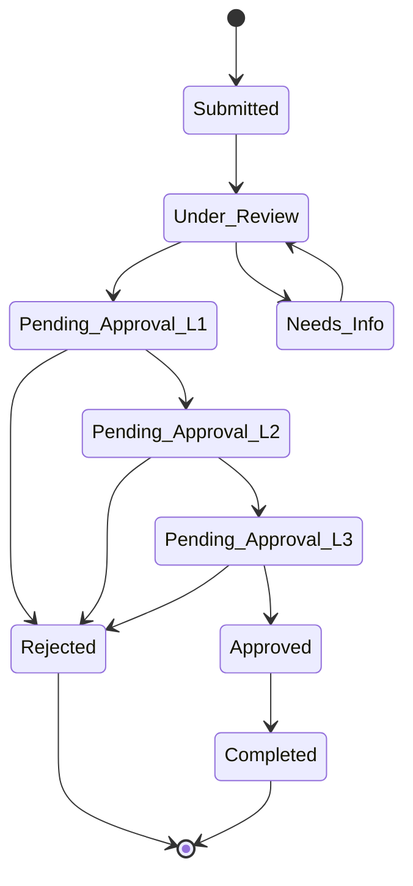

### Status Definitions
- **Submitted**: Request submitted by employee
- **Under Review**: Initial review by first approver
- **Pending Approval L1**: Awaiting first level approval
- **Pending Approval L2**: Awaiting second level approval
- **Pending Approval L3**: Awaiting final approval
- **Needs Info**: Additional information required
- **Approved**: Request approved
- **Rejected**: Request rejected
- **Completed**: Request processed and completed

---

## 🔐 Role-Based Access

### Employee Permissions
- ✅ Submit all request types
- ✅ View own requests
- ✅ Edit draft requests
- ✅ Cancel pending requests (before approval)
- ✅ Upload supporting documents
- ❌ Approve requests
- ❌ View others' requests

### Manager Permissions
- ✅ View team requests
- ✅ Approve/Reject requests (Level 1)
- ✅ Add comments to requests
- ✅ Request additional information
- ✅ View request history
- ✅ Generate team reports
- ❌ Delete requests

### HR Permissions
- ✅ View all requests
- ✅ Approve/Reject requests (Level 2)
- ✅ Edit request details
- ✅ Generate certificates
- ✅ Access employee records
- ✅ System-wide reports
- ✅ Configure approval workflows

### Admin/Executive Permissions
- ✅ Full access to all requests
- ✅ Final approval authority (Level 3)
- ✅ Override decisions
- ✅ System configuration
- ✅ User management
- ✅ Audit logs access

---

## 📧 Notification System

### Email Notifications
All stakeholders receive email notifications at key stages:
1. **Submission**: Confirmation to employee
2. **Pending Approval**: Alert to next approver
3. **Approved/Rejected**: Decision notification to employee
4. **Needs Info**: Request for additional information
5. **Completed**: Final completion notification

### In-System Notifications
Real-time notifications displayed in:
- Dashboard notification bell 🔔
- Request status page
- Employee dashboard

### SMS Notifications (Optional)
- Urgent requests
- Final decisions
- Approaching deadlines

---

## 🔄 API Endpoints Summary

### Common Endpoints (All Requests)
```
GET    /api/requests                    # Get all requests (filtered by role)
GET    /api/requests/:type/:id           # Get specific request
POST   /api/requests/:type               # Create new request
PUT    /api/requests/:type/:id           # Update request
DELETE /api/requests/:type/:id           # Cancel/Delete request
POST   /api/requests/:type/:id/approve   # Approve request
POST   /api/requests/:type/:id/reject    # Reject request
GET    /api/requests/:type/:id/history   # Get request history
POST   /api/requests/:type/:id/comment   # Add comment
GET    /api/requests/:type/:id/documents # Get request documents
POST   /api/requests/:type/:id/documents # Upload document
```

### Request Types
- `onboarding` - Direct employment/onboarding
- `clearance` - Clearance/exit
- `assignment` - Assignment/delegation
- `assignment-termination` - End assignment
- `internal-transfer` - Internal transfer
- `delegation` - Delegation
- `leave` - Leave request
- `exit` - Exit/resignation
- `certificate` - Salary certificate
- `experience-certificate` - Experience certificate

---

## 📋 Database Tables

### Core Tables
1. **`Onboarding_Requests`** - Direct employment requests
2. **`Clearance_Requests`** - Clearance/exit requests
3. **`Assignment_Requests`** - Assignment requests
4. **`Assignment_Termination_Requests`** - Assignment termination
5. **`Internal_Transfer_Requests`** - Transfer requests
6. **`Delegation_Requests`** - Delegation requests
7. **`Leave_Requests`** - Leave requests
8. **`Exit_Requests`** - Exit/resignation requests
9. **`Certificate_Requests`** - Certificate requests

### Supporting Tables
- **`Request_Approvals`** - Approval history
- **`Request_Comments`** - Comments and notes
- **`Request_Documents`** - Attached documents
- **`Request_Notifications`** - Notification log
- **`Audit_Events`** - Full audit trail

---

## 🎯 Best Practices

### For Employees
1. ✅ Fill all required fields completely
2. ✅ Attach supporting documents
3. ✅ Submit requests with adequate notice
4. ✅ Check request status regularly
5. ✅ Respond promptly to information requests
6. ✅ Keep contact information updated

### For Managers
1. ✅ Review requests within 2 business days
2. ✅ Provide clear rejection reasons
3. ✅ Request information if needed
4. ✅ Consider impact on team operations
5. ✅ Document decision rationale
6. ✅ Forward to next level promptly

### For HR
1. ✅ Verify all information accuracy
2. ✅ Ensure policy compliance
3. ✅ Maintain confidentiality
4. ✅ Process requests in order
5. ✅ Keep employees informed
6. ✅ Archive completed requests

---

## 🆘 Support & Troubleshooting

### Common Issues

**Request Stuck in Pending**
- Check with current approver
- Verify approver is active in system
- Contact HR for escalation

**Cannot Submit Request**
- Verify all required fields filled
- Check file size limits for attachments
- Clear browser cache
- Try different browser

**Wrong Approval Route**
- Contact HR to reassign request
- Update organizational structure if needed

**Need to Cancel Approved Request**
- Contact HR department
- Submit cancellation form
- Manager approval required

### Contact Information
- **HR Department**: hr@kauh.sa
- **IT Support**: it@kauh.sa
- **System Issues**: admin@kauh.sa
- **Phone**: +966 XX XXX XXXX

---

## 📈 Reporting & Analytics

### Available Reports
1. **Request Volume Report** - Requests by type and period
2. **Processing Time Report** - Average processing time
3. **Approval Rate Report** - Approval vs rejection rates
4. **Department Activity Report** - Requests by department
5. **Pending Requests Report** - Current pending requests
6. **SLA Compliance Report** - Requests meeting SLA

### Access Reports
Navigate to: **Admin Dashboard → Reports → Request Analytics**

---

## 🔄 System Updates & Maintenance

This document is maintained by the HR & IT departments and updated quarterly.

**Last Updated**: November 2025  
**Version**: 1.0  
**Next Review**: February 2026

---

## 📞 Quick Reference

| Request Type | Typical Processing Time | Approval Levels | Priority |
|-------------|------------------------|-----------------|----------|
| Onboarding | 5-7 business days | 3 levels | High |
| Clearance | 10-15 business days | 5 departments | High |
| Assignment | 3-5 business days | 4 levels | Medium |
| Assignment End | 2-3 business days | 3 levels | Medium |
| Internal Transfer | 7-10 business days | 4 levels | Medium |
| Delegation | 2-3 business days | 3 levels | Low |
| Leave | 3-5 business days | 3 levels | Medium |
| Exit | 30+ business days | Multi-dept | High |
| Salary Certificate | 2-3 business days | 2 levels | Low |
| Experience Certificate | 3-5 business days | 2 levels | Low |

---

**END OF DOCUMENT**

*For technical documentation, see: `/Backend/API_DOCUMENTATION.md`*  
*For user guides, see: `/Frontend/USER_GUIDES/`*

