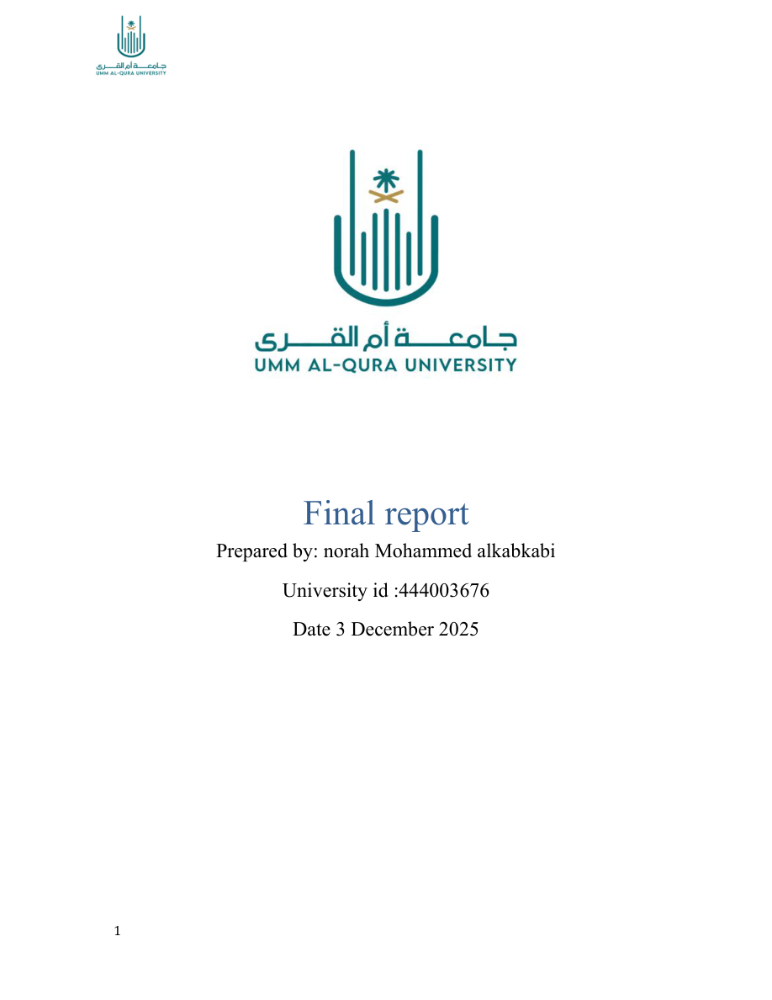
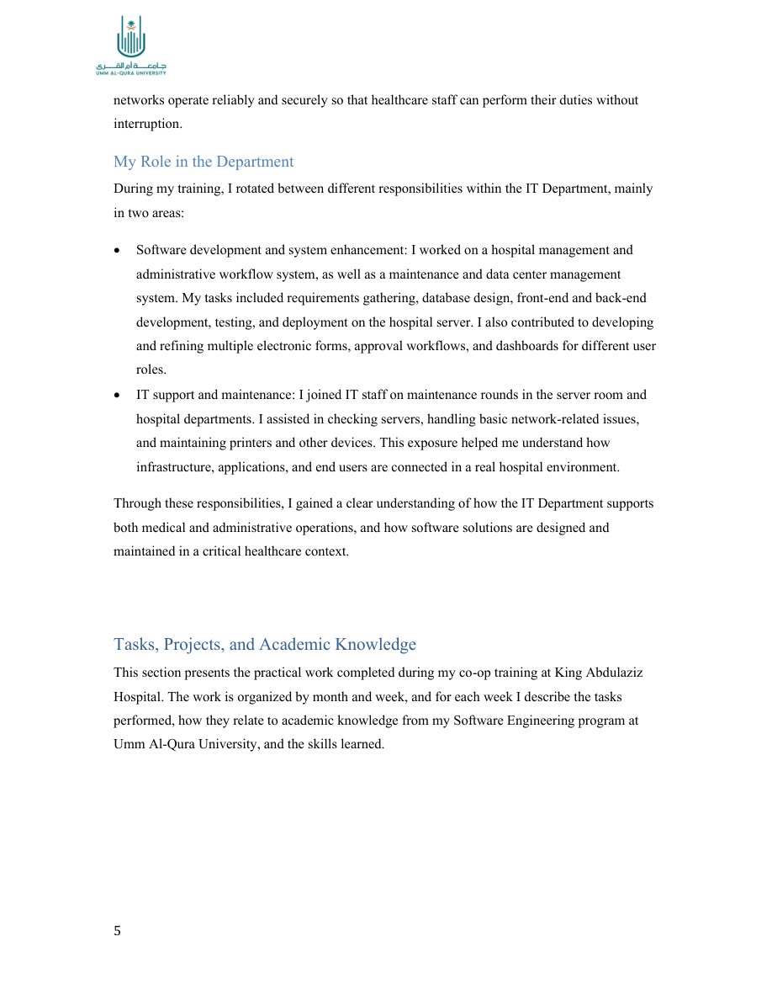
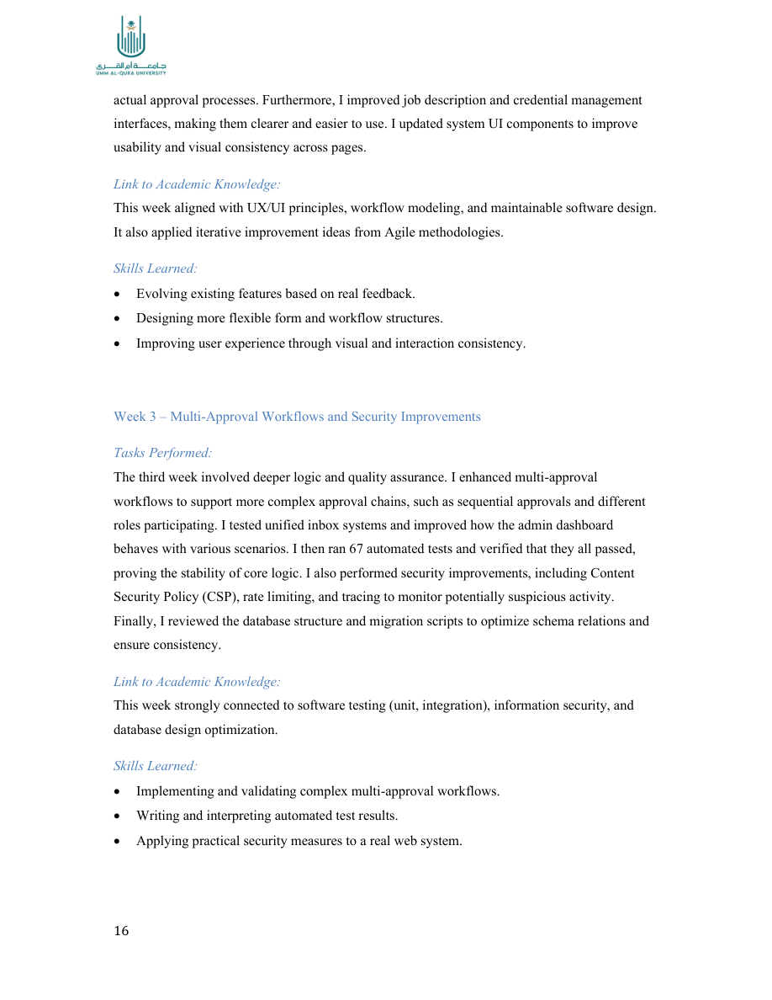
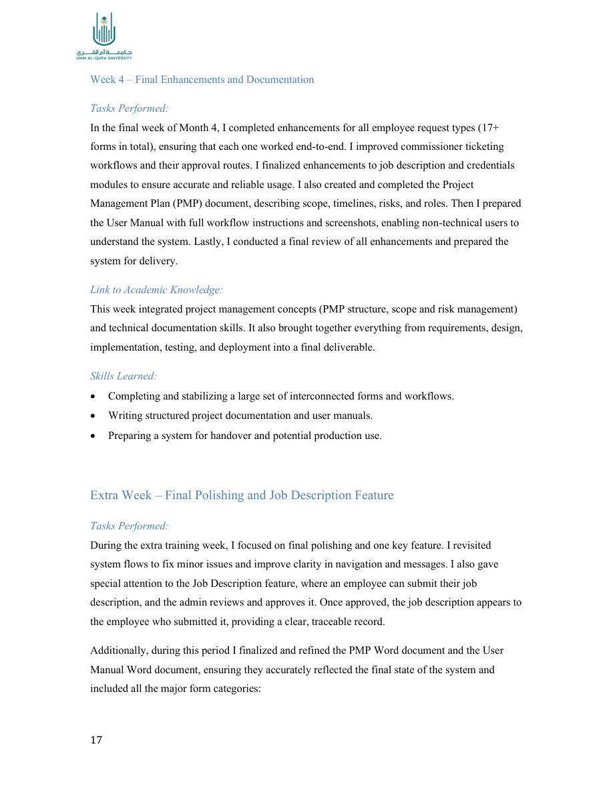

# Hospital Management System

**Co-operative Training Project** — King Abdulaziz Hospital (Makkah) · Umm Al-Qura University · Software Engineering

[](https://alkabkabi1.github.io/hosipital-mangment-intermidate/)
[](https://github.com/Alkabkabi1/hosipital-mangment-intermidate/actions/workflows/ci.yml)
[](LICENSE)

A full-stack hospital administrative workflow system built during my co-op internship at the **IT Department of King Abdulaziz Hospital**. The system handles employee requests, multi-step approvals, role-based access control, and 17+ HR/administrative form types used in a real government healthcare environment.

<p align="center">
  
</p>

> Full training report: [Training_Report_Colored.pdf](Training_Report_Colored.pdf)  
> Live project page: [alkabkabi1.github.io/hosipital-mangment-intermidate](https://alkabkabi1.github.io/hosipital-mangment-intermidate/)

---

## About this project

During my co-operative training (Software Engineering, Umm Al-Qura University), I worked on designing and building a hospital management and administrative workflow system from requirements gathering through deployment and documentation.

The internship covered the full software lifecycle: analysis, database design, backend APIs, frontend pages, testing, security hardening, and handover documentation (PMP + user manual).

<p align="center">
  
</p>

---

## Screenshots

<p align="center">
  
  <br />
  <em>Workflow enhancements, UI/UX improvements, and multi-approval logic</em>
</p>

<p align="center">
  
  <br />
  <em>17+ employee request types — clearance, onboarding, leave, housing, travel, guarantees, and more</em>
</p>

---

## What I learned

| Area | Skills gained |
|------|----------------|
| **Full-stack development** | TypeScript, Express.js, REST APIs, vanilla HTML/CSS/JS frontend |
| **Databases** | MySQL schema design, migrations, relationships, query optimization |
| **Security** | JWT auth, RBAC, bcrypt, CORS, CSP headers, rate limiting |
| **Workflows** | Multi-approval chains, commissioner delegation, status tracking |
| **Software engineering** | Repository/service/controller layering, modular architecture, refactoring |
| **Testing** | Vitest unit & integration tests (67+ automated tests) |
| **DevOps & delivery** | Environment config, deployment setup, production-readiness checks |
| **Documentation** | Project management plan, user manual, technical developer docs |

### Challenges I worked through

- Building a complete full-stack app for the first time in a real hospital environment
- Connecting concepts from multiple courses (DB, web dev, networks, security) into one system
- Handling changing requirements and iterating on 17+ interconnected forms
- Balancing development work with IT maintenance responsibilities early in the internship

---

## Key features

- Multi-approval workflow engine (sequential approvals across roles)
- Role-based access control with permissions and role templates
- Employee request inbox + admin dashboard
- Commissioner delegation system
- Audit logging for compliance
- Arabic + English UI support
- 17+ request form modules, including:
  - **Core:** Clearance, Onboarding, Delegation
  - **Certificates:** Identification, Experience
  - **Assignments:** Assignment, Termination, Internal Transfer
  - **Leave:** Standard leave, Maternity leave
  - **Housing:** Saudi doctor allowance, Contractor housing
  - **Travel:** Travel orders, airline tickets, compensations
  - **Guarantees:** Detailed, fine/performance, public law
  - **Other:** Reward refund, Exit request, Job description approval

---

## Tech stack

| Layer | Technologies |
|-------|--------------|
| Backend | Node.js, Express 5, TypeScript, Zod, Pino |
| Frontend | HTML5, CSS3, JavaScript (ES6+) |
| Database | MySQL 8 |
| Auth | JWT, bcrypt |
| Security | Helmet, CORS, rate limiting, CSP |
| Testing | Vitest, Supertest |
| Tooling | ESLint, Prettier, tsx |

---

## Project structure

```
├── Backend/           # TypeScript API (Express)
│   ├── src/           # Source modules (auth, requests, RBAC, audit, …)
│   ├── migrations/    # MySQL schema & seed SQL
│   └── tests/         # Vitest specs
├── Frontend/          # Static HTML / CSS / JS pages
├── config/            # .env.example template
├── docs/              # Developer docs + README images
├── scripts/           # Utility & test scripts
└── Training_Report_Colored.pdf
```

Detailed developer documentation: [docs/DEVELOPER_README.md](docs/DEVELOPER_README.md)

---

## Getting started

### Prerequisites

- Node.js 18+
- MySQL 8+
- npm 8+

### 1. Clone and install

```bash
git clone https://github.com/Alkabkabi1/hosipital-mangment-intermidate.git
cd hosipital-mangment-intermidate
npm run install-all
```

### 2. Configure environment

```bash
cp config/.env.example .env
# Edit .env with your DB credentials and JWT_SECRET
```

### 3. Set up the database

Import the schema using your MySQL client:

```bash
# Example — adjust user/host as needed
mysql -u root -p hospital_app < Backend/migrations/COMPLETE_DATABASE_SCHEMA.sql
```

See `Backend/migrations/README.md` for migration details.

### 4. Build and run

```bash
npm run build
npm run dev      # development (tsx watch)
# or
npm start        # production (compiled dist/)
```

API default: `http://localhost:3037`

### 5. Run tests (requires configured MySQL)

```bash
npm test
```

---

## Architecture

```
┌─────────────┐     HTTP/REST      ┌──────────────────┐
│  Frontend   │ ◄────────────────► │  Express API     │
│  HTML/JS/CSS│                    │  TypeScript      │
└─────────────┘                    └────────┬─────────┘
                                            │
                                   ┌────────▼─────────┐
                                   │  MySQL 8         │
                                   │  migrations +    │
                                   │  RBAC schema     │
                                   └──────────────────┘
```

---

## Author

**Norah Mohammed Alkabkabi**  
Software Engineering — Umm Al-Qura University (ID: 444003676)  
Co-operative Training — King Abdulaziz Hospital, Makkah

---

## License

MIT — see [LICENSE](LICENSE).
