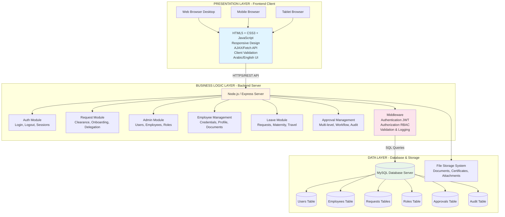
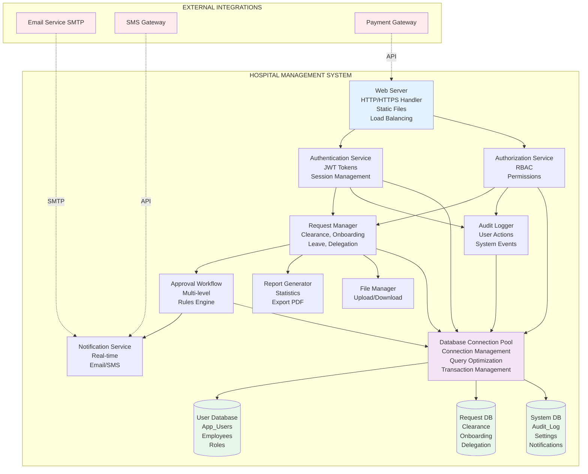
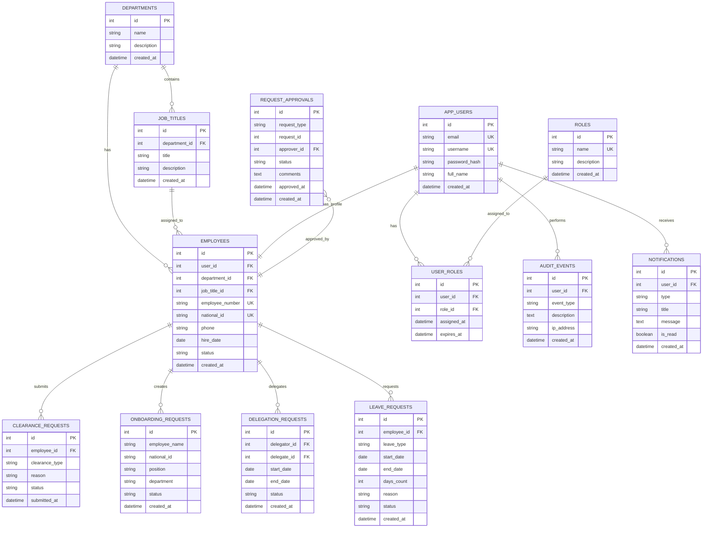
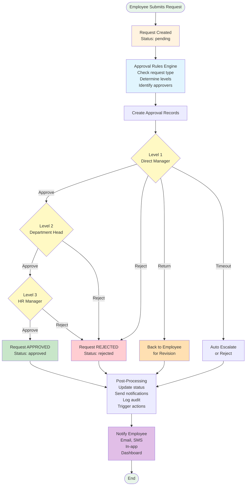
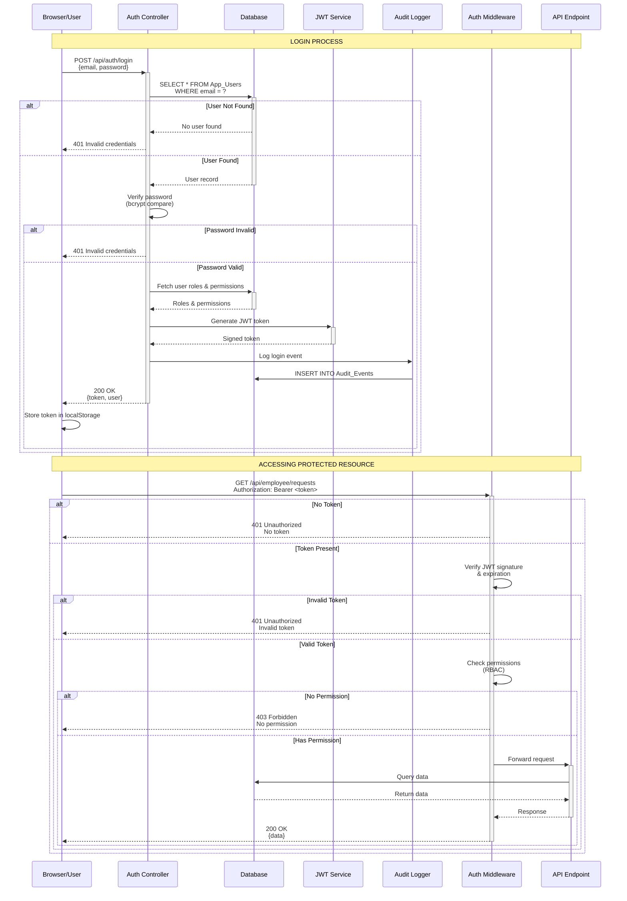
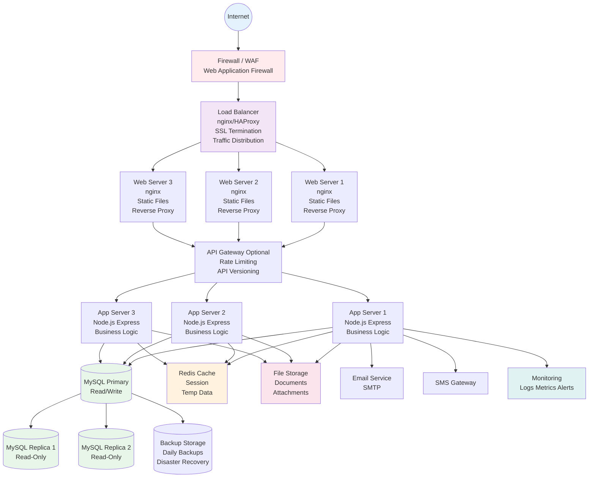
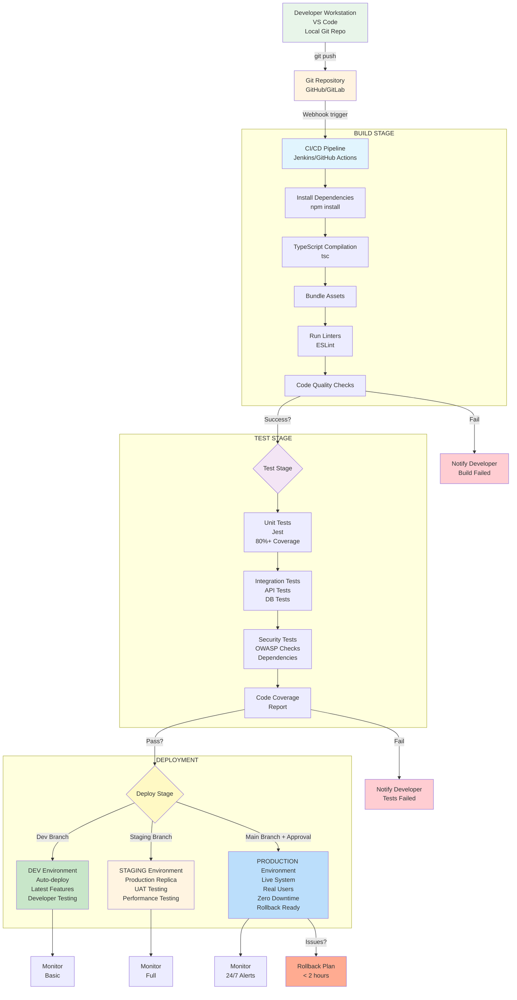

# 📊 Hospital Management System - Mermaid Diagrams
## For PMP Document Appendices

All diagrams are in Mermaid format for easy rendering and embedding.

---

## Diagram 1: System Architecture (Three-Tier Architecture)



---

## Diagram 2: System Components and Integration



---

## Diagram 3: Database Entity Relationship Diagram (ERD)



---

## Diagram 4: Request Workflow and Approval Process



---

## Diagram 5: User Authentication and Authorization Flow



---

## Diagram 6: API Endpoints Structure

```mermaid
graph TB
    API["/api<br/>Base API Endpoint"]
    
    API --> Health["/health<br/>GET: System Health"]
    
    API --> Auth["/auth<br/>Authentication"]
    Auth --> Login["/login POST"]
    Auth --> Logout["/logout POST"]
    Auth --> Refresh["/refresh POST"]
    
    API --> Admin["/admin<br/>Administration"]
    Admin --> AdminUsers["/users GET/POST"]
    Admin --> AdminEmployees["/employees GET/PUT"]
    Admin --> AdminClearance["/clearance GET"]
    
    API --> Profile["/profile<br/>GET/PUT"]
    
    API --> Roles["/roles<br/>CRUD Operations"]
    
    API --> Users["/users<br/>User Management"]
    
    API --> Clearance["/clearance<br/>Clearance Requests"]
    
    API --> Onboarding["/onboarding<br/>New Employee"]
    
    API --> Delegation["/delegation<br/>Delegation Requests"]
    
    API --> Leave["/leave-request<br/>Leave Management"]
    
    API --> Maternity["/maternity-leave<br/>Maternity Requests"]
    
    API --> Travel["/travel-order<br/>Travel Orders"]
    
    API --> Housing["/housing-allowance<br/>Housing Requests"]
    
    API --> Certificate["/certificate<br/>Certificate Requests"]
    
    API --> Experience["/experience-certificate<br/>Experience Certs"]
    
    API --> Transfer["/internal-transfer<br/>Transfer Requests"]
    
    API --> Assignment["/assignment<br/>Assignment Requests"]
    
    API --> Termination["/assignment-termination<br/>Termination Requests"]
    
    API --> Exit["/exit<br/>Exit Requests"]
    
    API --> MultiApproval["/multi-approval<br/>Approval System"]
    MultiApproval --> Pending["/pending GET"]
    MultiApproval --> Approve["/id/approve POST"]
    MultiApproval --> Reject["/id/reject POST"]
    
    API --> Commissioner["/commissioner/tickets<br/>Ticket System"]
    
    API --> Upload["/upload<br/>File Upload POST"]
    
    style API fill:#4CAF50,color:#fff
    style Auth fill:#2196F3,color:#fff
    style Admin fill:#FF9800,color:#fff
    style MultiApproval fill:#9C27B0,color:#fff
```



---

## Diagram 7: Deployment Architecture (Production)



---

## Diagram 8: Development & Testing Pipeline (CI/CD)



---

## How to Use These Mermaid Diagrams

### Method 1: Render in Markdown Viewers
- GitHub, GitLab, and many modern markdown editors support Mermaid automatically
- Just view this file and the diagrams will render

### Method 2: Export as Images
1. **Using Mermaid Live Editor:**
   - Go to https://mermaid.live
   - Copy and paste each diagram
   - Click "Actions" → "PNG" or "SVG"
   - Download and insert into Word document

2. **Using VS Code:**
   - Install "Markdown Preview Mermaid Support" extension
   - Open this file
   - Right-click on preview → "Save as Image"

3. **Using Command Line:**
   ```bash
   npm install -g @mermaid-js/mermaid-cli
   mmdc -i DIAGRAMS_MERMAID.md -o diagrams/
   ```

### Method 3: Embed in Documentation
- Many documentation tools (GitBook, Docusaurus, MkDocs) support Mermaid natively
- Confluence and Notion have Mermaid plugins

### Method 4: Screenshot from Web
- Use Mermaid Live Editor (https://mermaid.live)
- Take high-quality screenshots
- Insert into your PMP document

---

## Diagram Details

### Diagram 1: System Architecture
Shows the three-tier architecture with frontend, backend, and database layers.

### Diagram 2: System Components
Illustrates the integration between internal modules and external services.

### Diagram 3: ERD
Complete entity-relationship diagram showing all database tables and their relationships.

### Diagram 4: Workflow
Depicts the multi-level approval process for requests.

### Diagram 5: Auth Flow
Sequence diagram showing authentication and authorization process.

### Diagram 6: API Structure
Visual representation of all API endpoints organized by module.

### Diagram 7: Deployment
Production deployment architecture with load balancing and redundancy.

### Diagram 8: CI/CD Pipeline
Development and testing workflow from code commit to production.

---

**Generated For:**
- Project: Hospital Management System
- Organization: مستشفى الملك عبد العزيز  
- Version: 1.0
- Date: November 19, 2025
- Prepared by: نوره محمد الكبكبي

