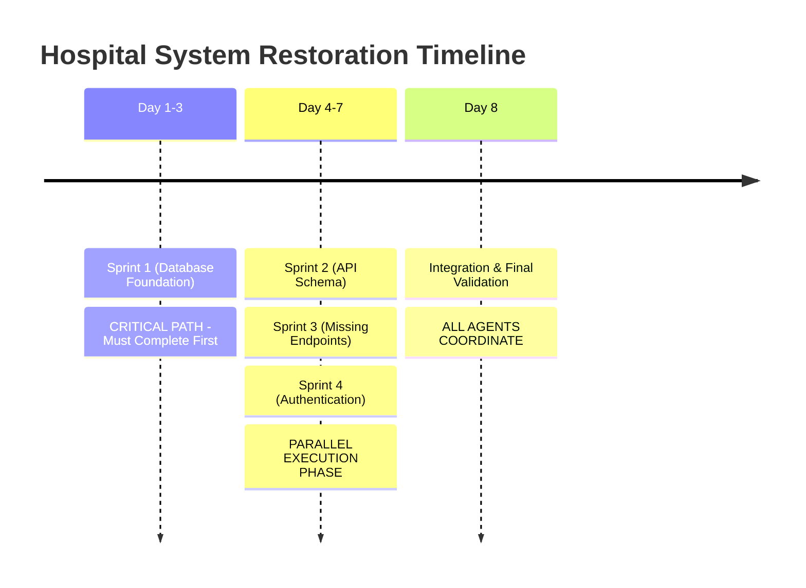

# 🤝 Parallel Sprint Coordination Guide - Multi-Agent Claude Sonnet 3.5 Execution

## 📖 Overview & Coordination Strategy

### **Multi-Agent Parallel Execution Setup**
You are part of a **4-agent Claude Sonnet 3.5 team** executing simultaneous sprints to restore a critical Hospital Request Management System from 32% to 95%+ functionality. This guide ensures seamless coordination between parallel agents working on interdependent system components.

### **Sprint Assignment & Timing**


### **Agent Specializations**
- **Agent 1 (Database Foundation)**: Database schema, table creation, column fixes
- **Agent 2 (API Schema Alignment)**: DTO validation, parameter binding, schema synchronization
- **Agent 3 (Missing Endpoints)**: Controller creation, endpoint implementation, response standardization
- **Agent 4 (Authentication & Authorization)**: JWT validation, role-based access, security implementation

---

## 🔄 Coordination Protocols

### **Phase 1: Sequential Foundation (Days 1-3)**

#### **Sprint 1 Agent - Database Foundation**
```bash
# Sprint 1 agent creates these coordination files upon completion:
touch SPRINT_1_COMPLETED.flag
echo "$(date): Database foundation completed" >> sprint_completion_log.txt

# Generate handoff documentation:
mysqldump -h localhost -u nora -p --no-data nora_database > database_schema_after_sprint1.sql
node scripts/comprehensive-test-suite.js > test_results_after_sprint1.json
```

#### **Parallel Agents - Waiting Protocol**
```bash
# Sprints 2, 3, 4 wait for Sprint 1 completion signal
while [ ! -f "SPRINT_1_COMPLETED.flag" ]; do
    echo "$(date): Waiting for Sprint 1 database foundation completion..."
    sleep 300  # Check every 5 minutes
done

echo "✅ Sprint 1 completed - beginning parallel execution"
```

---

### **Phase 2: Parallel Execution Coordination (Days 4-7)**

#### **Daily Synchronization Schedule**
```
09:00 - Morning Standup (15 minutes)
12:00 - Midday Integration Check (10 minutes)  
17:00 - End-of-Day Coordination (20 minutes)
```

#### **Morning Standup Protocol (09:00)**
Each agent reports using standardized format:

```markdown
## Agent [X] Daily Report - [DATE]

### Sprint Status:
- Overall Progress: [X]% complete
- Current Day's Target: [specific tasks]
- Blocked/Waiting On: [other agents/external]

### Completed Since Last Sync:
- [ ] Task 1: [description] - [impact on other sprints]
- [ ] Task 2: [description] - [impact on other sprints]

### Integration Points Today:
- Need from Agent 2: [specific requirements]
- Need from Agent 3: [specific requirements]  
- Need from Agent 4: [specific requirements]
- Providing to others: [shared resources/files]

### Blocking Issues:
- [ ] Issue 1: [description] - [estimated resolution time]
- [ ] Issue 2: [description] - [help needed from which agent]

### Testing Results:
- Comprehensive test improvement: [before] → [after]
- Sprint-specific metrics: [details]

### Tomorrow's Plan:
- [ ] Priority 1: [task with timeline]
- [ ] Priority 2: [task with timeline]
```

#### **File-Based Coordination System**

Create shared coordination files for asynchronous communication:

```bash
# Shared coordination directory structure
mkdir -p coordination/shared
mkdir -p coordination/sprint2
mkdir -p coordination/sprint3  
mkdir -p coordination/sprint4

# Shared resource files
touch coordination/shared/validation_patterns.ts      # Sprint 2 creates, others use
touch coordination/shared/response_formats.json      # Sprint 3 creates, others use  
touch coordination/shared/auth_guards.ts            # Sprint 4 creates, others use
touch coordination/shared/integration_status.md     # All agents update
```

---

## 🔀 Critical Integration Points

### **Sprint 2 ↔ Sprint 3 Integration**

#### **Shared Validation Patterns**
```typescript
// File: coordination/shared/validation_patterns.ts
// Sprint 2 creates, Sprint 3 uses

export const SharedValidationDecorators = {
  IsEmployeeName: () => { /* implementation */ },
  IsArabicString: () => { /* implementation */ },
  IsSaudiDate: () => { /* implementation */ }
};

export const StandardErrorResponses = {
  ValidationError: (message: string) => ({
    success: false,
    code: 'VALIDATION_ERROR',
    message
  }),
  NotFound: (resource: string) => ({
    success: false, 
    code: 'NOT_FOUND',
    message: `${resource} not found`
  })
};
```

#### **Response Format Standardization**
```json
// File: coordination/shared/response_formats.json
// Sprint 3 creates, Sprint 2 uses
{
  "success_response": {
    "success": true,
    "data": "...",
    "timestamp": "ISO_STRING"
  },
  "error_response": {
    "success": false,
    "message": "string",
    "code": "ERROR_CODE",
    "timestamp": "ISO_STRING"
  },
  "list_response": {
    "success": true,
    "data": "array",
    "count": "number",
    "timestamp": "ISO_STRING"
  }
}
```

### **Sprint 3 ↔ Sprint 4 Integration**

#### **Authentication Guard Sharing**
```typescript
// File: coordination/shared/auth_guards.ts
// Sprint 4 creates, Sprint 3 uses

export const StandardGuardCombinations = {
  Public: [], // No guards needed
  Employee: [JwtAuthGuard],
  Admin: [JwtAuthGuard, AdminGuard],
  ResourceOwner: [JwtAuthGuard, ResourceOwnerGuard]
};

export const GuardUsagePatterns = {
  AdminEndpoint: '@UseGuards(...StandardGuardCombinations.Admin)',
  EmployeeEndpoint: '@UseGuards(...StandardGuardCombinations.Employee)',
  ResourceEndpoint: '@UseGuards(...StandardGuardCombinations.ResourceOwner)'
};
```

### **Sprint 2 ↔ Sprint 4 Integration**

#### **User Context Validation**
```typescript
// Coordinate on user object structure in JWT tokens
export interface StandardUserContext {
  id: number;
  email: string;
  roles: string[];
  role: string; // backward compatibility
  tokenType: 'access' | 'refresh';
}

// Sprint 2 uses in validation, Sprint 4 ensures JWT tokens provide this structure
```

---

## 🚨 Conflict Resolution Protocols

### **File Modification Conflicts**

#### **Conflict Prevention Strategy**
```bash
# Each agent works in designated file ownership areas:

# Sprint 2 Primary Files:
# - src/modules/*/dto/*.dto.ts
# - src/shared/decorators/
# - src/shared/utils/sql-parameter-handler.ts

# Sprint 3 Primary Files:  
# - src/modules/*/controller/*.controller.ts (new endpoints only)
# - src/modules/employee/
# - src/modules/admin/ (enhancements)

# Sprint 4 Primary Files:
# - src/auth/
# - src/shared/services/authorization.service.ts
# - src/shared/guards/
```

#### **When Conflicts Occur**
```bash
# Step 1: Immediate communication
echo "CONFLICT: Agent [X] - [description] - $(date)" >> coordination/conflicts.log

# Step 2: Coordinate resolution via shared files
# Create temporary branch or backup before resolving
cp conflicted_file.ts conflicted_file.backup.ts

# Step 3: Document resolution
echo "RESOLVED: [solution description] - $(date)" >> coordination/conflicts.log
```

### **Integration Testing Conflicts**

#### **Testing Schedule Coordination**
```bash
# Avoid simultaneous comprehensive testing
# Create testing lock system:

testing_lock() {
    local agent_id=$1
    local lock_file="coordination/testing.lock"
    
    if [ -f "$lock_file" ]; then
        echo "Testing locked by $(cat $lock_file) - waiting..."
        sleep 60
        testing_lock $agent_id
    else
        echo "$agent_id" > "$lock_file"
        echo "Testing lock acquired by $agent_id"
    fi
}

testing_unlock() {
    rm -f "coordination/testing.lock"
    echo "Testing lock released"
}

# Usage:
testing_lock "Agent2"
node scripts/comprehensive-test-suite.js > my_test_results.json
testing_unlock
```

---

## 📊 Integration Validation

### **Midday Integration Check (12:00)**
```bash
# Quick validation script run by all agents
#!/bin/bash
# File: coordination/midday_check.sh

echo "=== MIDDAY INTEGRATION CHECK $(date) ==="

# Check compilation
echo "🔧 TypeScript Compilation Check:"
cd Backend && npm run build
if [ $? -eq 0 ]; then
    echo "✅ Compilation successful"
else
    echo "❌ Compilation failed - coordinate immediately"
fi

# Quick endpoint test
echo "🌐 Basic Endpoint Test:"
curl -s http://localhost:3037/api/health > /dev/null
if [ $? -eq 0 ]; then
    echo "✅ Server responsive"
else
    echo "❌ Server issues - coordinate immediately" 
fi

# Database connection test
echo "🗄️ Database Connection Test:"
node -e "
const mysql = require('mysql2/promise');
mysql.createConnection({
    host: 'localhost', user: 'nora', password: 'nora123', database: 'nora_database'
}).then(() => console.log('✅ Database connected')).catch(() => console.log('❌ Database issues'));
"

echo "=== Integration check complete ==="
```

### **End-of-Day Coordination (17:00)**

#### **Comprehensive Integration Validation**
```bash
# Full system validation run by coordination lead (rotating daily)
#!/bin/bash
# File: coordination/end_of_day_validation.sh

echo "=== END OF DAY VALIDATION $(date) ==="

# Run comprehensive test suite
echo "🧪 Running comprehensive test suite..."
cd "$(dirname "$0")/.."
node scripts/comprehensive-test-suite.js > "test_results_$(date +%Y%m%d).json"

# Parse results
echo "📊 Test Results Summary:"
cat "test_results_$(date +%Y%m%d).json" | grep -E "PASS|FAIL|SKIP" | tail -10

# Check for critical failures
CRITICAL_FAILURES=$(cat "test_results_$(date +%Y%m%d).json" | grep -c "CRITICAL.*FAIL")
if [ $CRITICAL_FAILURES -gt 0 ]; then
    echo "🚨 CRITICAL FAILURES DETECTED: $CRITICAL_FAILURES"
    echo "Emergency coordination required"
fi

# Update integration status
echo "Last updated: $(date)" > coordination/shared/integration_status.md
echo "Total test success rate: $(grep -o '[0-9]\+%' test_results_$(date +%Y%m%d).json | tail -1)" >> coordination/shared/integration_status.md

echo "=== End of day validation complete ==="
```

---

## 🎯 Success Metrics & Milestones

### **Daily Success Targets**

#### **Day 4 (First Parallel Day)**
- Sprint 2: 2-3 DTOs fixed, parameter binding issues resolved
- Sprint 3: Employee summary endpoint created and functional
- Sprint 4: JWT authentication guard enhanced, admin access restored
- **Target System Success**: 40-50%

#### **Day 5**
- Sprint 2: All 7 request DTOs aligned, validation standardized  
- Sprint 3: Multi-approval endpoints created, exit requests functional
- Sprint 4: Employee authorization issues resolved, resource access working
- **Target System Success**: 60-70%

#### **Day 6**
- Sprint 2: Parameter binding completed, error handling standardized
- Sprint 3: All missing endpoints implemented, response formats consistent
- Sprint 4: Complete authorization system implemented, security hardened
- **Target System Success**: 80-85%

#### **Day 7**
- All Sprints: Integration complete, comprehensive testing passes
- System-wide validation and performance optimization
- **Target System Success**: 95%+

### **Integration Success Criteria**

#### **Technical Integration**:
- [ ] All TypeScript compilation successful without conflicts
- [ ] Shared utilities used consistently across sprints  
- [ ] Database operations use Sprint 1 foundation without issues
- [ ] Authentication works seamlessly with all new endpoints

#### **Functional Integration**:
- [ ] Complete end-to-end user workflows functional
- [ ] Admin and employee roles work across all request types
- [ ] Response formats consistent across all endpoints
- [ ] Error handling and messaging standardized

#### **Performance Integration**:
- [ ] No performance degradation from parallel changes
- [ ] Database queries optimized and efficient  
- [ ] API response times acceptable (<2 seconds)
- [ ] System handles concurrent user load

---

## 🔧 Emergency Protocols

### **Critical Failure Response**

#### **If System Success Rate Drops Below 50%**
```bash
# Emergency coordination protocol
echo "EMERGENCY: System success rate critical - all agents coordinate immediately"

# Stop current work, focus on integration issues
# Priority: Restore basic functionality before adding features

# Emergency checklist:
# 1. Revert to last known good state
# 2. Identify conflicting changes  
# 3. Coordinate resolution strategy
# 4. Implement fixes in coordinated sequence
# 5. Validate before proceeding
```

#### **If Agent Becomes Unavailable**
```bash
# Agent backup protocol
echo "Agent [X] unavailable - redistributing critical tasks"

# Sprint 2 backup: Focus on most critical DTO fixes first
# Sprint 3 backup: Implement only essential missing endpoints  
# Sprint 4 backup: Focus on admin access restoration only

# Adjust timeline and scope accordingly
```

### **Final Integration Day (Day 8)**

#### **Comprehensive System Validation**
```bash
# Final validation protocol run by all agents together
#!/bin/bash
# File: coordination/final_validation.sh

echo "=== FINAL SYSTEM VALIDATION $(date) ==="

# Complete test suite
echo "🧪 Running complete test battery..."
node scripts/quick-test.js > final_quick_test.json
node scripts/test-specific-issues.js > final_specific_test.json  
node scripts/comprehensive-test-suite.js > final_comprehensive_test.json

# Functional workflow tests
echo "👥 Testing complete user workflows..."
# Test admin workflow: login → view dashboard → approve requests
# Test employee workflow: login → submit request → check status

# Performance validation
echo "⚡ Performance validation..."
# Test response times under load
# Validate database query performance
# Check memory usage and optimization

# Security validation  
echo "🔒 Security validation..."
# Test authentication across all endpoints
# Validate authorization boundaries  
# Verify no security regressions

# Generate final report
echo "📋 Generating final system report..."
cat > FINAL_SYSTEM_REPORT.md << EOF
# Hospital Request Management System - Final Validation Report

## Test Results Summary:
- Quick Test: [results from final_quick_test.json]
- Specific Issues: [results from final_specific_test.json]  
- Comprehensive Test: [results from final_comprehensive_test.json]

## System Success Rate: [final percentage]

## Sprint Completion Status:
- Sprint 1 (Database): [status]
- Sprint 2 (API Schema): [status]
- Sprint 3 (Missing Endpoints): [status] 
- Sprint 4 (Authentication): [status]

## Production Readiness Assessment:
[READY/NOT READY with justification]

EOF

echo "=== Final validation complete - system ready for production ==="
```

---

## 🎉 Success Celebration Protocol

When the system achieves 95%+ success rate:

```bash
echo "🎉 MISSION ACCOMPLISHED 🎉"
echo "Hospital Request Management System restored from 32% to 95%+ functionality"
echo "Multi-agent Claude Sonnet 3.5 parallel execution successful"
echo ""
echo "System now ready to serve hospital staff with:"
echo "✅ Complete request type coverage (11 types)"
echo "✅ Robust authentication and authorization"  
echo "✅ Comprehensive API endpoint coverage"
echo "✅ Optimized database foundation"
echo "✅ Consistent validation and error handling"
echo ""
echo "Thank you for professional coordination and systematic execution!"
```

---

*This coordination guide ensures that multiple Claude Sonnet 3.5 agents can work in parallel efficiently, avoiding conflicts while maximizing the benefits of specialized expertise and parallel execution speed.*
